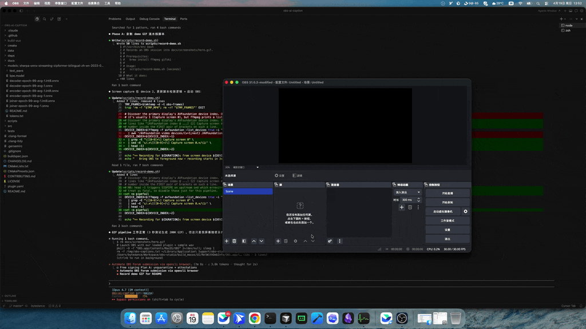

# 🎙️ obs-ai-caption

> **On-device, real-time AI captions for OBS Studio — no cloud, no API keys, no data leaves your machine.**

<p align="center">
  <a href="https://github.com/XWHQSJ/obs-ai-caption/actions/workflows/push.yaml"></a>
  <a href="https://github.com/XWHQSJ/obs-ai-caption/releases/latest"></a>
  <a href="LICENSE"></a>
  <a href="#-platforms"></a>
  <a href="https://obsproject.com/"></a>
</p>

<p align="center">
  <b>Streaming ASR &middot; Bilingual (EN + 中文) &middot; Sensitive-word beep &middot; GPU accel &middot; MIT-cheap runtime</b>
</p>

<p align="center">
  
</p>

---

## ✨ Why this plugin?

| Existing caption plugins | obs-ai-caption |
| --- | --- |
| 🌐 Send audio to Google / Azure / AWS | 🔒 **100% on-device** streaming ASR |
| 💸 Pay per minute of transcription | 💚 **Free forever** — open source, GPL-2.0 |
| 📡 Require a stable internet connection | ✈️ **Runs offline** once model is downloaded |
| 🇬🇧 English-only, often | 🈷️ **中英双语** streaming Zipformer included |
| 🎛️ No built-in profanity control | 🤫 **Adaptive beep mute** with per-speaker pitch |

Built on [sherpa-onnx](https://github.com/k2-fsa/sherpa-onnx)'s streaming
Zipformer transducer — the same engine used by Next-gen Kaldi for low-latency
production transcription.

---

## 🖼️ Features at a glance

<table>
<tr>
<td width="50%">

### 🎯 Real-time captions

- Partial results within **~100 ms** after speech
- Final segmentation via rule-based endpointer
- Writes atomically to a `.txt` file you feed into any OBS Text source

</td>
<td width="50%">

### 📥 One-click model download

- Pick English / bilingual / tiny preset inside the filter panel
- Progress bar + SHA verification
- Cached under `~/…/obs-studio/plugin_config/obs-ai-caption/`

</td>
</tr>
<tr>
<td width="50%">

### 🤫 Sensitive-word mute

- Load a hotwords file (`word :boost`)
- Plugin **delays output audio** so it can retroactively beep out matches
- Beep frequency/volume adapts to the live speaker's **F0 + RMS**

</td>
<td width="50%">

### ⚡ Hardware acceleration

- **CPU** (default, universal)
- **CUDA** (Windows + NVIDIA GPU)
- **DirectML** (Windows + any GPU)
- CoreML backend on macOS (coming v0.2)

</td>
</tr>
</table>

---

## 🚀 Install

### Option A — GitHub Releases (today)

1. Head to the [latest release](https://github.com/XWHQSJ/obs-ai-caption/releases/latest) and grab:
   - Windows: `obs-ai-caption-<version>-windows-x64.zip`
   - macOS:   `obs-ai-caption-<version>-macos-universal.pkg`
2. **Windows** — extract the zip, merge `obs-plugins\` and `data\obs-plugins\`
   into `%ProgramFiles%\obs-studio\`.
3. **macOS** — double-click the `.pkg`; it installs into
   `~/Library/Application Support/obs-studio/plugins/`.
4. Restart OBS.

> ### 🛡️ About the unsigned release
>
> We don't yet hold Apple Developer ID or Windows Authenticode certificates
> — both cost money that a free, MIT-licensed plugin shouldn't have to pay.
> Until we qualify for [SignPath Foundation](https://signpath.org) (free
> Windows OSS signing) or a community-sponsored macOS identity, install
> requires a one-time bypass:
>
> - **macOS Gatekeeper** — right-click the `.pkg` → *Open* → *Open*, or
>   run the unquarantine helper after install:
>   ```bash
>   curl -L https://github.com/XWHQSJ/obs-ai-caption/raw/main/scripts/unquarantine-macos.sh | bash
>   ```
> - **Windows SmartScreen** — *More info* → *Run anyway* on the first
>   extraction.
>
> Every release also carries a verifiable **Sigstore build provenance
> attestation** you can check with
> [`gh attestation verify`](https://docs.github.com/en/actions/security-for-github-actions/using-artifact-attestations),
> so you can be sure the binary came out of this exact GitHub Actions run
> even without a traditional code-signing certificate.

### Option B — OBS Plugin Manager (future)

OBS's official Plugin Manager is still an
[open RFC (#4)](https://github.com/obsproject/rfcs/pull/4) upstream. Once
it ships we'll submit for automatic install/update inside OBS Studio.
Until then, GitHub Releases is the canonical distribution channel.

---

## 🎬 First use (60 seconds)

```
  ┌───────────────┐   ┌─────────────────┐   ┌────────────────┐
  │  Audio Source │   │  AI Captions    │   │ Text (GDI+)    │
  │  (mic / desk) │──▶│   Filter        │──▶│ Read from file │
  └───────────────┘   │   + Downloader  │   └────────────────┘
                      └─────────────────┘
```

1. Right-click an audio source → **Filters → + → AI Captions**
2. Click **Download Model…** and pick a preset
3. Set **Caption Output File** to `/tmp/captions.txt` (or anywhere)
4. Add a `Text (GDI+)` / `Text (FreeType 2)` source → enable
   **Read from file** → point it at the same path
5. Speak. Watch captions.

---

## 🧠 Model presets

| Preset | Languages | Size | Latency | Best for |
| --- | --- | --- | --- | --- |
| **English (20M, fast)** | en | ~70 MB | ~120 ms | default streamers |
| **Chinese + English** | zh, en | ~300 MB | ~180 ms | bilingual content |
| **English (tiny)** | en | ~40 MB | ~90 ms | low-end CPUs |

Models come from the official
[sherpa-onnx model zoo](https://github.com/k2-fsa/sherpa-onnx/releases/tag/asr-models).
Download is one-shot and cached; re-installing the plugin does not re-download.

---

## 🛠️ Build from source

Dependencies (obs-studio, Qt6, sherpa-onnx) are fetched automatically by
`buildspec.json`. You only need CMake 3.28+ and a platform toolchain.

```bash
# macOS
cmake --preset macos -S . -B build_macos \
  -DCMAKE_OSX_DEPLOYMENT_TARGET=11.0
cmake --build build_macos --config RelWithDebInfo -j

# Windows (PowerShell)
cmake --preset windows-x64 -S . -B build_x64
cmake --build build_x64 --config RelWithDebInfo -j

# Offline unit tests — no OBS, no sherpa-onnx, no internet
cmake -S tests -B build-tests
cmake --build build-tests -j
ctest --test-dir build-tests --output-on-failure
# -> 45 passed, 0 failed
```

---

## 🏗️ Architecture

```
 ┌─────────────── caption-filter.cpp ────────────────┐
 │  OBS audio cb ─┐                ┌── caption file  │
 │                ▼                │                 │
 │     ┌────────────────┐   ┌──────┴──────┐          │
 │     │ AudioAnalyzer  │   │ Subtitle    │          │
 │     │ (RMS + F0)     │   │ Manager     │          │
 │     └──────┬─────────┘   └─────────────┘          │
 │            │                                       │
 │     ┌──────▼─────────┐   ┌─────────────┐          │
 │     │ AudioDelayBuf  │   │ AsrEngine   │◀─ model  │
 │     │ (+ BeepGen)    │   │ (decode thd)│   dir    │
 │     └──────┬─────────┘   └─────┬───────┘          │
 │            │                   │                  │
 │         audio out          partials/              │
 │                            finals                 │
 └───────────────────────────────────────────────────┘
                            │
                            ▼
                     MuteWordList
              ascii/utf-8 hotword matcher
```

- **SPSC lock-free ring buffer** (`AudioRingBuffer`) between OBS audio thread and ASR decode thread
- **Autocorrelation pitch detector** adapts the beep frequency to the speaker
- **Word-boundary-aware hotword matcher** handles ASCII and mixed CJK
- **Atomic caption file writes** so downstream readers never see a half-written line

---

## 🧪 Quality


- 45 unit tests across ring buffer, analyzer, delay line, mute matcher, subtitle manager, model finder
- Tests run under `-Werror` + AddressSanitizer + UndefinedBehaviorSanitizer in CI
- Regression tests for every fixed bug (SPSC lost-wakeup, boundary underflow, …)

---

## 🗺️ Roadmap

- [x] macOS universal + Windows x64 CI builds
- [x] On-demand model download UI
- [ ] Code signing (Apple Developer ID + Windows Authenticode)
- [ ] Watch upstream [RFC #4](https://github.com/obsproject/rfcs/pull/4) for Plugin Manager, submit when ready
- [ ] CoreML provider on macOS (faster on Apple Silicon)
- [ ] More languages (ja, ko, es)
- [ ] Whisper-based fallback for broadcast-grade accuracy

---

## 🤝 Contributing

PRs welcome! See [CONTRIBUTING.md](CONTRIBUTING.md) for how to build, run
tests, and open a pull request. Bug reports and feature requests go in
[issues](https://github.com/XWHQSJ/obs-ai-caption/issues).

---

## 📜 License & credits

Licensed under the **MIT License** — see [LICENSE](LICENSE).

Built on the work of:

- [obsproject/obs-studio](https://github.com/obsproject/obs-studio) — the streaming suite itself
- [obsproject/obs-plugintemplate](https://github.com/obsproject/obs-plugintemplate) — build-system scaffolding
- [k2-fsa/sherpa-onnx](https://github.com/k2-fsa/sherpa-onnx) — streaming ASR runtime

If this plugin saves you money on captioning, please consider starring the
repo and dropping a thank-you to the sherpa-onnx team.

---

<p align="center">
  <sub>Built with ❤️ for streamers who care about privacy.</sub>
</p>
